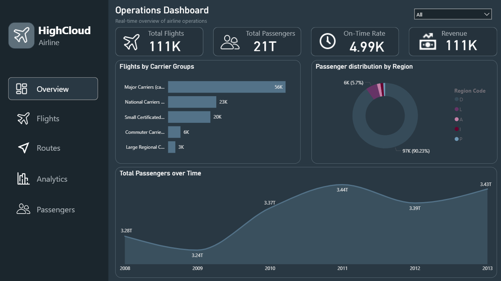
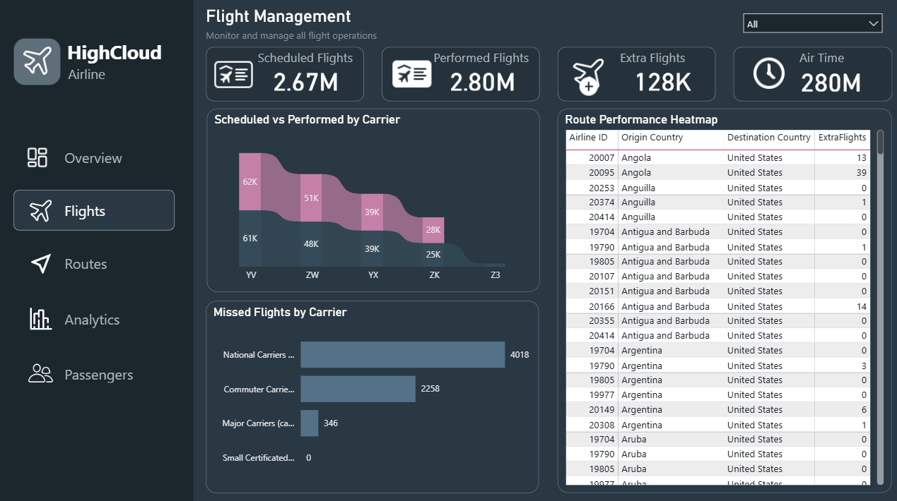
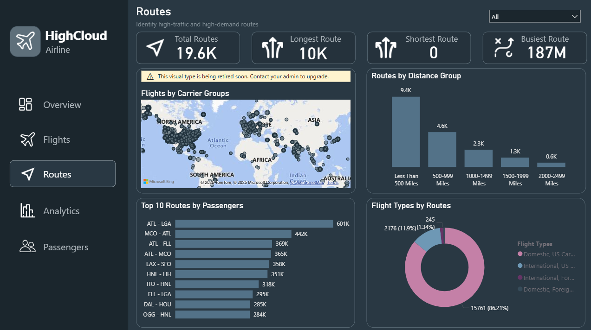
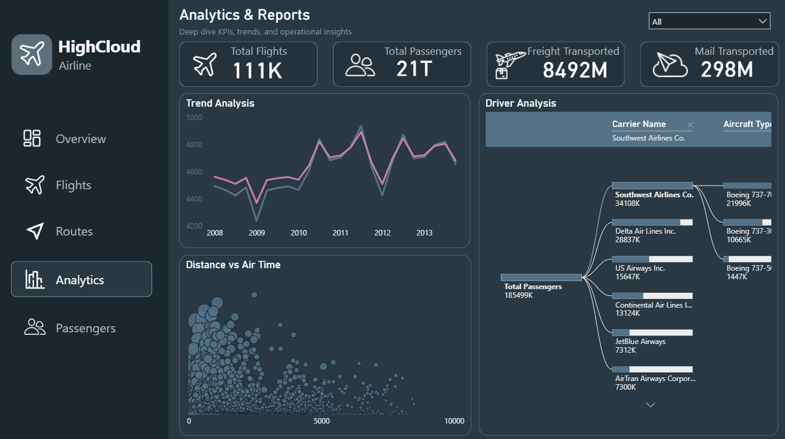
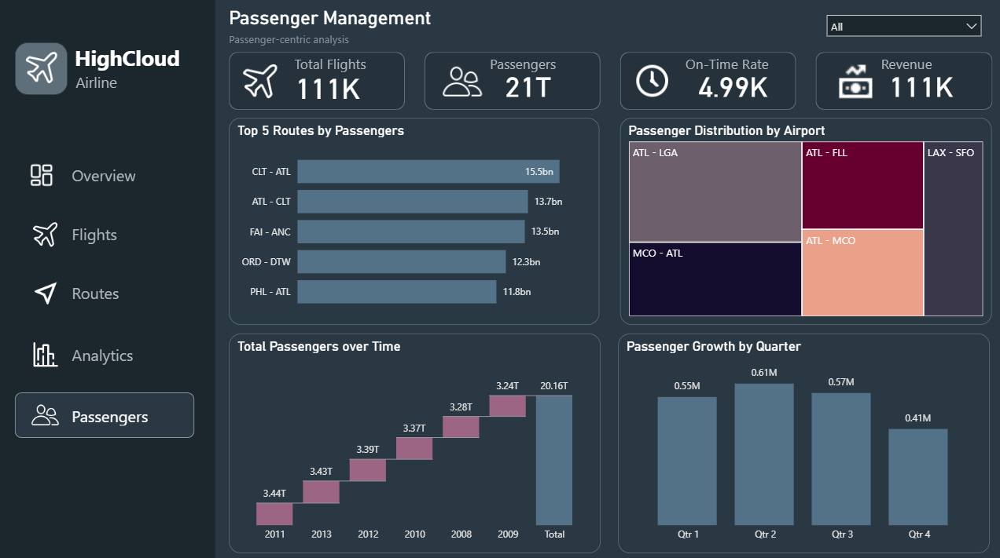

# ✈️ HighCloud Airlines
Advanced Multi-Page Power BI Project | Operations • Flights • Routes • Analytics • Passengers

## 📌 Overview
An end-to-end airline operations and decision analytics solution built on **110,852 flight and passenger records**.
The project delivers a **multi-page Power BI dashboard** designed to support operational monitoring, trend analysis, and data-driven decision-making, forming a strong analytical foundation for predictive and AI-driven initiatives in airline management.

---

## 🎯 Business Objective
- Airline operations teams required a centralized analytical system to:
- Monitor daily flight operations
- Analyze route and passenger performance
- Identify operational inefficiencies
- Enable analytics-driven planning and optimization

---

## ⭐ STAR Method Breakdown

### **S — Situation**
The airline faced challenges in understanding operational efficiency across flights, routes, carriers, and passengers due to large, fragmented datasets.

### **T — Task**
Design an executive-ready, multi-page analytics solution that provides:
- Operational KPIs and trend analysis
- Route and carrier performance insights
- Passenger demand analysis
- Drill-through, interactive visuals, and navigation
- Insights usable for **forecasting and optimization decisions**

### **A — Action**
- Cleaned & transformed **110k+ rows using Power Query**
- Built **5 analytical dashboards**: Operations, Flight Management, Routes, Analytics, Passengers
- Created advanced **DAX measures**:
  - Load Factor
  - On-Time Performance
  - Passenger Growth
  - Route-level KPIs
- Applied **statistical trend analysis** to identify seasonal and quarterly patterns
- Designed advanced visuals: Ribbon Charts, Waterfall, Decomposition Tree, Maps, Treemaps
- Implemented drill-through filters, slicers, conditional formatting, and dynamic KPIs
- Ensured **data consistency and validation** across tools

### **R — Result**
- Identified **ATL–LGA** as the highest passenger route (601K passengers)
- Highlighted **National Carriers** as having the highest missed flights (4,018)
- Showed **Domestic flight dominance (86.21%)**
- Determined **2011 as the peak year** and **Q2 as the highest growth quarter (0.61M passengers)**
- Delivered a decision-ready analytics platform improving visibility and supporting strategic route and capacity planning

---

## 🔑 Key Insights
- Top 10 high-traffic routes
- Domestic vs International split
- Route performance by distance group
- On-time performance trends
- Passenger growth by month and quarter
- Carrier and Aircraft efficiency analysis

---

## 📊 Dashboard Pages

### 1️⃣ Operations Overview 
- Real-time overview of airline operations

### 2️⃣ Flight Management
Monitor and manage all flight operations

### 3️⃣ Route Insights
Identify high-traffic and high-demand routes

### 4️⃣ Analytics & Reports
Trend insights and operational drivers

### 5️⃣ Passenger Management
Passenger behavior, growth, and distribution

---

## 🔗 Live Preview
([Live Dashboard](https://app.powerbi.com/groups/me/reports/773d6057-d84a-4c02-8d3b-cd72958323cd/74ecc8dde9253a60b79b?experience=power-bi))

---

## 💼 Business Use Cases
- Airline Operations Monitoring
- Route Optimization Support
- Passenger Demand Analysis
- Carrier Performance Evaluation
- Executive Decision Reporting

---

## 🤖 Analytics → AI Readiness
While this project focuses on **analytics and decision intelligence**, the outputs directly support:
- **Passenger demand forecasting**
- **Route profitability prediction**
- **Anomaly detection in flight delays**
- **Optimization models for capacity planning**

These analytics layers serve as **foundational inputs for predictive and AI models** in real-world airline environments.

---

## 📊 Tools & Technologies
- Power BI (Final dashboard)
- Power Query & DAX
- SQL (Data extraction, joins, aggregations)
- Excel (Pivot Tables, Slicers, Charts)
- Tableau (Navigation-style dashboards, KPI cards, LOD expressions) 

---

## 🔄 Multi-Tool Implementation (Internship Project)

This project was built as part of my **Data Analytics Internship**, where I performed end-to-end analysis using multiple tools:

| Tool         | Role                                                                                                                                                                                                                 |
| ------------ | -------------------------------------------------------------------------------------------------------------------------------------------------------------------------------------------------------------------- |
| **Excel**    | Cleaned & analyzed raw flight data, built interactive dashboards ([Live Dashboard](https://github.com/shadantech/Airlines_Excel_Dashboard))                                                                                  |
| **SQL**      | Data extraction & preparation, route performance queries                                                                                                                                                             |
| **Tableau**  | Navigation-style dashboards, KPIs, trend & map analysis                                                                                                                                                              |
| **Power BI** | Advanced multi-page dashboard, dynamic KPIs, drill-through, DAX measures ([Live Dashboard](https://app.powerbi.com/groups/me/reports/773d6057-d84a-4c02-8d3b-cd72958323cd/74ecc8dde9253a60b79b?experience=power-bi)) |

---

## 🧩 Project Context
This project was completed as part of my Data Analytics Internship, involving end-to-end analysis across multiple tools to deliver business-ready insights in a consulting-style environment.

---

## 👤 Author
**Shadan**   
_Data Analyst_

🔗 [LinkedIn Profile](https://www.linkedin.com/in/shadansarfaraz1)  
🔗 [Tableau Public Profile](https://public.tableau.com/app/profile/shadansarfaraz/vizzes)
🔗 [Newsletter](https://shadansarfaraz.substack.com/)

---

## ⭐ Show Your Support
If you found this project insightful, give it a **⭐ Star** on GitHub — it helps others discover it too!  
Connect on **LinkedIn** for more Power BI, Tableau, and Data Analytics projects.